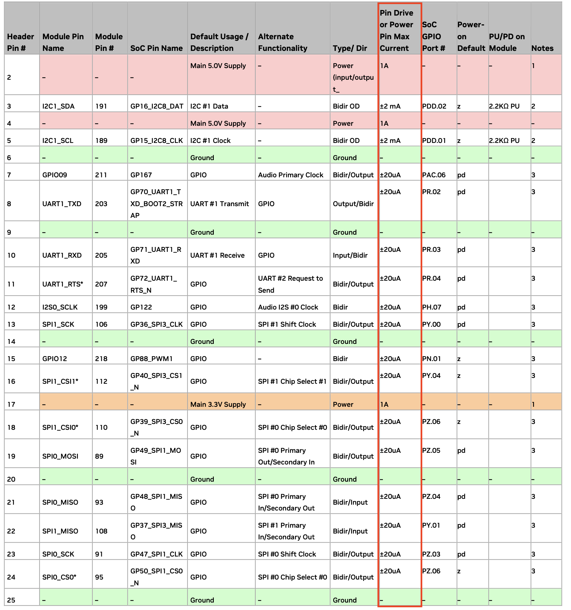

## Useful Link
* 2075X servo [link](https://traxxas.com/products/parts/servos/2075X)
* Control PWM Jetson Orin Nano via File Descriptor [link](https://github.com/NVIDIA/jetson-gpio/issues/105#issuecomment-1896157206)
* Hardware Spec Jetson Orin Nano [link](https://developer.nvidia.com/embedded/learn/jetson-orin-nano-devkit-user-guide/hardware_spec.html)
* Configure Jetson Orin Nano 40pin Headers [link](https://docs.nvidia.com/jetson/archives/r35.3.1/DeveloperGuide/text/HR/ConfiguringTheJetsonExpansionHeaders.html)

## Useful Command
DHCP config file (`/etc/dhcpd.conf`):
```bash
$ sudo pacman -S dhcp
$ sudo vim /etc/dhcpd.conf
option domain-name-servers 8.8.8.8, 8.8.4.4;
option subnet-mask 255.255.255.0;
option routers 10.5.5.1;
subnet 10.5.5.0 netmask 255.255.255.0 {
        range 10.5.5.2 10.5.5.254;
}
```
If there is the error: `non me lo ricordo` you have to remove some `lease` from `/var/lib/dhcp/dhcpd.leases`
Enable DHCP server:
```bash
$ sudo ip link set up eth0
$ sudo ip addr add 10.5.5.45/24 dev eth0
$ sudo systemctl start dhcpd4
```
Enable NAT Forwarding using `iptables`
```bash
$ sudo iptables -t nat -A POSTROUTING -o internet0 -j MASQUERADE
$ sudo iptables -A FORWARD -m conntrack --ctstate RELATED,ESTABLISHED -j ACCEPT
$ sudo iptables -A FORWARD -i net0 -o internet0 -j ACCEPT
```

## Pulse Width Modulation
* **PIN 17**: `/sys/class/pwm/pwmchip0`
* **PIN 33**: `/sys/class/pwm/pwmchip2`

Servo Motor controller: 
* period: 50Hz -> 20ms
* center: 1.5ms
* duty_cycle: 8%
* 5V output (Jetson Orin Nano -> 1.6V) [ci serve un level shifter (dio cristo)]


## Datasheet PINOUT Jetson Orin Nano


## Raspberry ROS2
* ROS2 on RaspOS [link](https://docs.ros.org/en/humble/How-To-Guides/Installing-on-Raspberry-Pi.html)
* ROS Docker [link](https://hub.docker.com/_/ros/tags)
* ODU-V2X [link](https://github.com/SalvatoreIandolo/ODU-V2X/tree/main)
* 11p-on-linux [link](https://gitlab.com/hpi-potsdam/osm/g5-on-linux/11p-on-linux)

## Pinout Rpi5


## Raspberry Workflow
```bash
$ sudo apt install minicom tmux vim software-properties-common
$ sudo date --set "..."
```

Installation of Docker on rpi5_pinout
```bash
$ sudo apt-get update
$ sudo apt-get install ca-certificates curl
$ sudo install -m 0755 -d /etc/apt/keyrings
$ sudo curl -fsSL https://download.docker.com/linux/debian/gpg -o /etc/apt/keyrings/docker.asc
$ sudo chmod a+r /etc/apt/keyrings/docker.asc
$ echo "deb [arch=$(dpkg --print-architecture) signed-by=/etc/apt/keyrings/docker.asc] https://download.docker.com/linux/debian $(. /etc/os-release && echo "$VERSION_CODENAME") stable" | sudo tee /etc/apt/sources.list.d/docker.list > /dev/null
$ sudo apt update
$ sudo apt install -y docker-ce docker-ce-cli containerd.io docker-buildx-plugin docker-compose-plugin
$ sudo usermod -aG docker "$USER"
```
