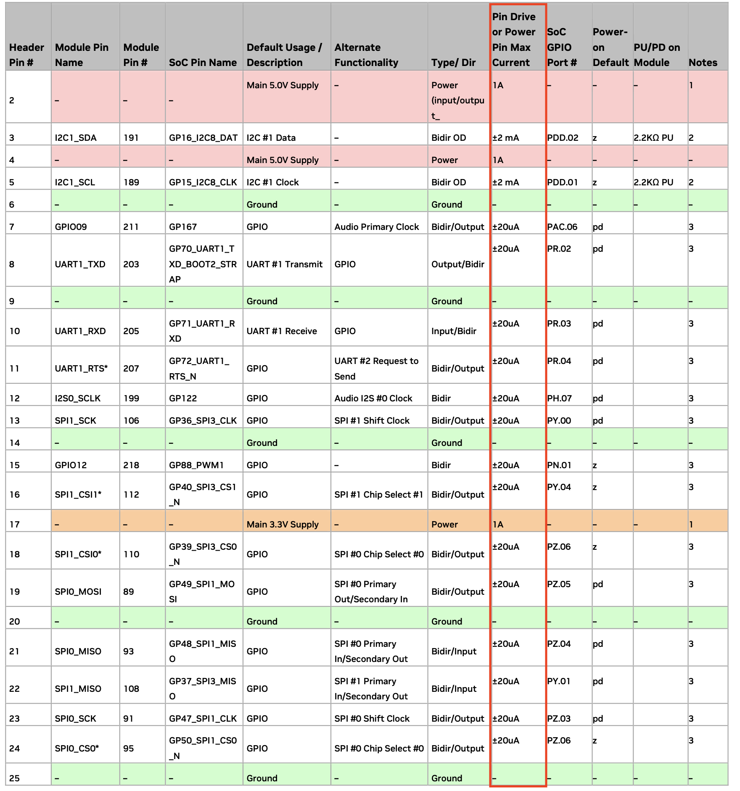

## Useful Link
* 2075X servo [link](https://traxxas.com/products/parts/servos/2075X)
* Control PWM Jetson Orin Nano via File Descriptor [link](https://github.com/NVIDIA/jetson-gpio/issues/105#issuecomment-1896157206)
* Hardware Spec Jetson Orin Nano [link](https://developer.nvidia.com/embedded/learn/jetson-orin-nano-devkit-user-guide/hardware_spec.html)

## Useful Command
Enable NAT Forwarding using `iptables`
```bash
$ sudo iptables -t nat -A POSTROUTING -o internet0 -j MASQUERADE
$ sudo iptables -A FORWARD -m conntrack --ctstate RELATED,ESTABLISHED -j ACCEPT
$ iptables -A FORWARD -i net0 -o internet0 -j ACCEPT
```

## Pulse Width Modulation
* **PIN 17**: `/sys/class/pwm/pwmchip0`
* **PIN 33**: `/sys/class/pwm/pwmchip2`


## Datasheet PINOUT Jetson Orin Nano

