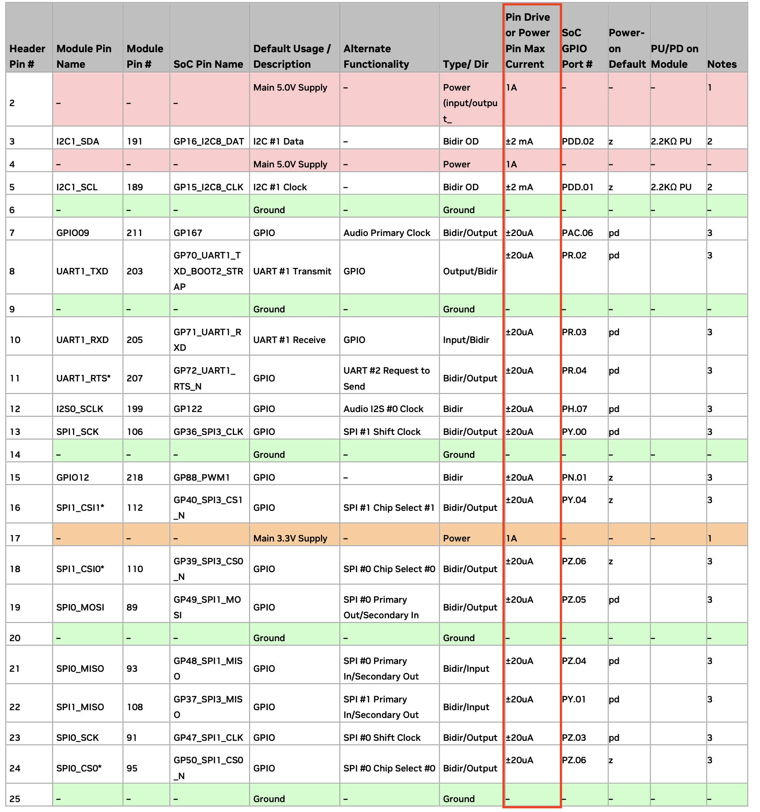
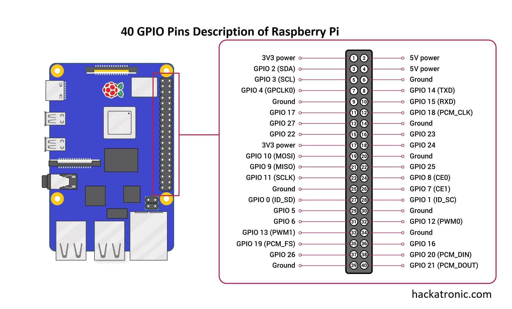

## Useful Link
* 2075X servo [link](https://traxxas.com/products/parts/servos/2075X)
* Control PWM Jetson Orin Nano via File Descriptor [link](https://github.com/NVIDIA/jetson-gpio/issues/105#issuecomment-1896157206)
* Hardware Spec Jetson Orin Nano [link](https://developer.nvidia.com/embedded/learn/jetson-orin-nano-devkit-user-guide/hardware_spec.html)
* Configure Jetson Orin Nano 40pin Headers [link](https://docs.nvidia.com/jetson/archives/r35.3.1/DeveloperGuide/text/HR/ConfiguringTheJetsonExpansionHeaders.html)

## Useful Command
DHCP config file (`/etc/dhcpd.conf`):
```bash
$ sudo pacman -S dhcp
$ sudo vim /etc/dhcpd.conf
option domain-name-servers 8.8.8.8, 8.8.4.4;
option subnet-mask 255.255.255.0;
option routers 10.5.5.1;
subnet 10.5.5.0 netmask 255.255.255.0 {
        range 10.5.5.2 10.5.5.254;
}
```
If there is the error: `non me lo ricordo` you have to remove some `lease` from `/var/lib/dhcp/dhcpd.leases`
Enable DHCP server:
```bash
$ sudo ip link set up eth0
$ sudo ip addr add 10.5.5.45/24 dev eth0
$ sudo systemctl start dhcpd4
```
Enable NAT Forwarding using `iptables`
```bash
$ sudo iptables -t nat -A POSTROUTING -o internet0 -j MASQUERADE
$ sudo iptables -A FORWARD -m conntrack --ctstate RELATED,ESTABLISHED -j ACCEPT
$ sudo iptables -A FORWARD -i net0 -o internet0 -j ACCEPT
$ sudo iptables -L -n -v --line-numbers
$ sudo ip route add default via [ip]
```

If you need to have two different ethernet interface on the "same" subnet is possible to create a bridge:
```bash
$ sudo ip link add br0 type bridge
$ sudo ip link set eth0 master br0
$ sudo ip link set eth1 master br0
$ sudo ip addr add 192.168.0.2/24 brd + dev br0
```

## Pulse Width Modulation
* **PIN 17**: `/sys/class/pwm/pwmchip0`
* **PIN 33**: `/sys/class/pwm/pwmchip2`

Servo Motor controller: 
* period: 50Hz -> 20ms
* center: 1.5ms
* duty_cycle: 8%
* 5V output (Jetson Orin Nano -> 1.6V) [ci serve un level shifter (dio cristo)]


## Datasheet PINOUT Jetson Orin Nano


## Raspberry ROS2
* ROS2 on RaspOS [link](https://docs.ros.org/en/humble/How-To-Guides/Installing-on-Raspberry-Pi.html)
* ROS Docker [link](https://hub.docker.com/_/ros/tags)
* ODU-V2X [link](https://github.com/SalvatoreIandolo/ODU-V2X/tree/main)
* 11p-on-linux [link](https://gitlab.com/hpi-potsdam/osm/g5-on-linux/11p-on-linux)

## Pinout Rpi5


## Raspberry Workflow
```bash
$ sudo apt install minicom tmux vim software-properties-common
$ sudo date --set "..."
```

Installation of Docker on rpi5_pinout
```bash
$ sudo apt-get update
$ sudo apt-get install ca-certificates curl
$ sudo install -m 0755 -d /etc/apt/keyrings
$ sudo curl -fsSL https://download.docker.com/linux/debian/gpg -o /etc/apt/keyrings/docker.asc
$ sudo chmod a+r /etc/apt/keyrings/docker.asc
$ echo "deb [arch=$(dpkg --print-architecture) signed-by=/etc/apt/keyrings/docker.asc] https://download.docker.com/linux/debian $(. /etc/os-release && echo "$VERSION_CODENAME") stable" | sudo tee /etc/apt/sources.list.d/docker.list > /dev/null
$ sudo apt update
$ sudo apt install -y docker-ce docker-ce-cli containerd.io docker-buildx-plugin docker-compose-plugin
$ sudo usermod -aG docker "$USER"
```

## Kernel problem - NVidia

```bash
$ sudo apt update
$ sudo apt install -y build-essential \
        bc bison flex libssl-dev libelf-dev \
        libncurses-dev git fakeroot dwarves \
        libncurses5 libncursesw5

$ wget "https://developer.nvidia.com/downloads/embedded/l4t/r36_release_v4.4/release/Jetson_Linux_r36.4.4_aarch64.tbz2"
$ tar -xvf public_sources.tbz2
$ cd Linux_for_Tegra
$ cat /etc/nv_tegra_release
# R36 (release), REVISION: 2.0, GCID: 35084178, BOARD: generic, EABI: aarch64, DATE: Tue Dec 19 05:55:03 UTC 2023
# KERNEL_VARIANT: oot
TARGET_USERSPACE_LIB_DIR=nvidia
TARGET_USERSPACE_LIB_DIR_PATH=usr/lib/aarch64-linux-gnu/nvidia
$ $ ./source/source_sync.sh -k -t r36.2.0
```
if this path does not work, is possible to download the source directly from the nvidia site, using the command:
```bash
$ wget "https://developer.nvidia.com/downloads/embedded/l4t/r36_release_v4.4/sources/public_sources.tbz2"
$ tar -xvf public_source.tbz2
```
and search the zipped file `kernel_source.tbz2`, after that make a backup of the current config file of the current kernel:
```bash
$ mkdir backup && cp /proc/config.gz ./backup/
$ zcat ./backup/config.gz > current_config
$ make oldddefconfig
$ diff .config current_config
```
The link can be change if you have different version of kernel using as base:
```
https://developer.nvidia.com/embedded/jetson-linux-r362
```
where it is necessary to change the `r362`

`/boot/extlinux/extlinux.conf` is the file where at the start up choose the image kernel change the file content from this one: 
```
TIMEOUT 30
DEFAULT JetsonIO

MENU TITLE L4T boot options

LABEL primary
      MENU LABEL primary kernel
      LINUX /boot/Image
      FDT /boot/dtb/kernel_tegra234-p3768-0000+p3767-0003-nv.dtb
      INITRD /boot/initrd
      APPEND ${cbootargs} root=PARTUUID=b6dcd88c-b06d-438f-b715-23ef3a2855a3 rw rootwait rootfstype=ext4 mminit_loglevel=4 console=ttyTCU0,115200 firmware_class.path=/etc/firmware fbcon=map:0 net.ifnames=0 nospectre_bhb video=efifb:off console=tty0 nv-auto-config 

# When testing a custom kernel, it is recommended that you create a backup of
# the original kernel and add a new entry to this file so that the device can
# fallback to the original kernel. To do this:
#
# 1, Make a backup of the original kernel
#      sudo cp /boot/Image /boot/Image.backup
#
# 2, Copy your custom kernel into /boot/Image
#
# 3, Uncomment below menu setting lines for the original kernel
#
# 4, Reboot

# LABEL backup
#    MENU LABEL backup kernel
#    LINUX /boot/Image.backup
#    FDT /boot/dtb/kernel_tegra234-p3768-0000+p3767-0003-nv.dtb
#    INITRD /boot/initrd
#    APPEND ${cbootargs}

LABEL JetsonIO
        MENU LABEL Custom Header Config: <HDR40 User Custom [2025-02-25-120902]>
        LINUX /boot/Image
        FDT /boot/dtb/kernel_tegra234-p3768-0000+p3767-0003-nv.dtb
        INITRD /boot/initrd
        APPEND ${cbootargs} root=PARTUUID=b6dcd88c-b06d-438f-b715-23ef3a2855a3 rw rootwait rootfstype=ext4 mminit_loglevel=4 console=ttyTCU0,115200 firmware_class.path=/etc/firmware fbcon=map:0 net.ifnames=0 nospectre_bhb video=efifb:off console=tty0 nv-auto-config
        OVERLAYS /boot/kernel_tegra234-p3768-0000+p3767-0003-nv-hdr40-user-custom.dtbo
```
to
```
TIMEOUT 30
DEFAULT JetsonIO

MENU TITLE L4T boot options

LABEL primary
      MENU LABEL primary kernel
      LINUX /boot/Image
      FDT /boot/dtb/kernel_tegra234-p3768-0000+p3767-0003-nv.dtb
      INITRD /boot/initrd
      APPEND ${cbootargs} root=PARTUUID=b6dcd88c-b06d-438f-b715-23ef3a2855a3 rw rootwait rootfstype=ext4 mminit_loglevel=4 console=ttyTCU0,115200 firmware_class.path=/etc/firmware fbcon=map:0 net.ifnames=0 nospectre_bhb video=efifb:off console=tty0 nv-auto-config 

# When testing a custom kernel, it is recommended that you create a backup of
# the original kernel and add a new entry to this file so that the device can
# fallback to the original kernel. To do this:
#
# 1, Make a backup of the original kernel
#      sudo cp /boot/Image /boot/Image.backup
#
# 2, Copy your custom kernel into /boot/Image
#
# 3, Uncomment below menu setting lines for the original kernel
#
# 4, Reboot

LABEL backup
        MENU LABEL backup kernel
        LINUX /boot/Image.backup
        FDT /boot/dtb/kernel_tegra234-p3768-0000+p3767-0003-nv.dtb
        INITRD /boot/initrd
        APPEND ${cbootargs} root=PARTUUID=b6dcd88c-b06d-438f-b715-23ef3a2855a3 rw rootwait rootfstype=ext4 mminit_loglevel=4 console=ttyTCU0,115200 firmware_class.path=/etc/firmware fbcon=map:0 net.ifnames=0 nospectre_bhb video=efifb:off console=tty0 nv-auto-config
        OVERLAYS /boot/kernel_tegra234-p3768-0000+p3767-0003-nv-hdr40-user-custom.dtbo

LABEL JetsonIO
        MENU LABEL Custom Header Config: <HDR40 User Custom [2025-02-25-120902]>
        LINUX /boot/Image
        FDT /boot/dtb/kernel_tegra234-p3768-0000+p3767-0003-nv.dtb
        INITRD /boot/initrd
        APPEND ${cbootargs} root=PARTUUID=b6dcd88c-b06d-438f-b715-23ef3a2855a3 rw rootwait rootfstype=ext4 mminit_loglevel=4 console=ttyTCU0,115200 firmware_class.path=/etc/firmware fbcon=map:0 net.ifnames=0 nospectre_bhb video=efifb:off console=tty0 nv-auto-config
        OVERLAYS /boot/kernel_tegra234-p3768-0000+p3767-0003-nv-hdr40-user-custom.dtbo
```

after that reboot it is necessary to:
```bash
$ sudo make modules_install+
$ sudo modprobe joydev
```

and for make persistance:
```bash
$ echo joydev | sudo tee /etc/modules-load.d/joydev.conf
```

the point cloud has a pitch of 180° is possible to apply using tf

```bash
$ ros2 run tf2_ros static_transform_publisher 0 0 0  0.0 3.141592 0.0 base_link update_link
```